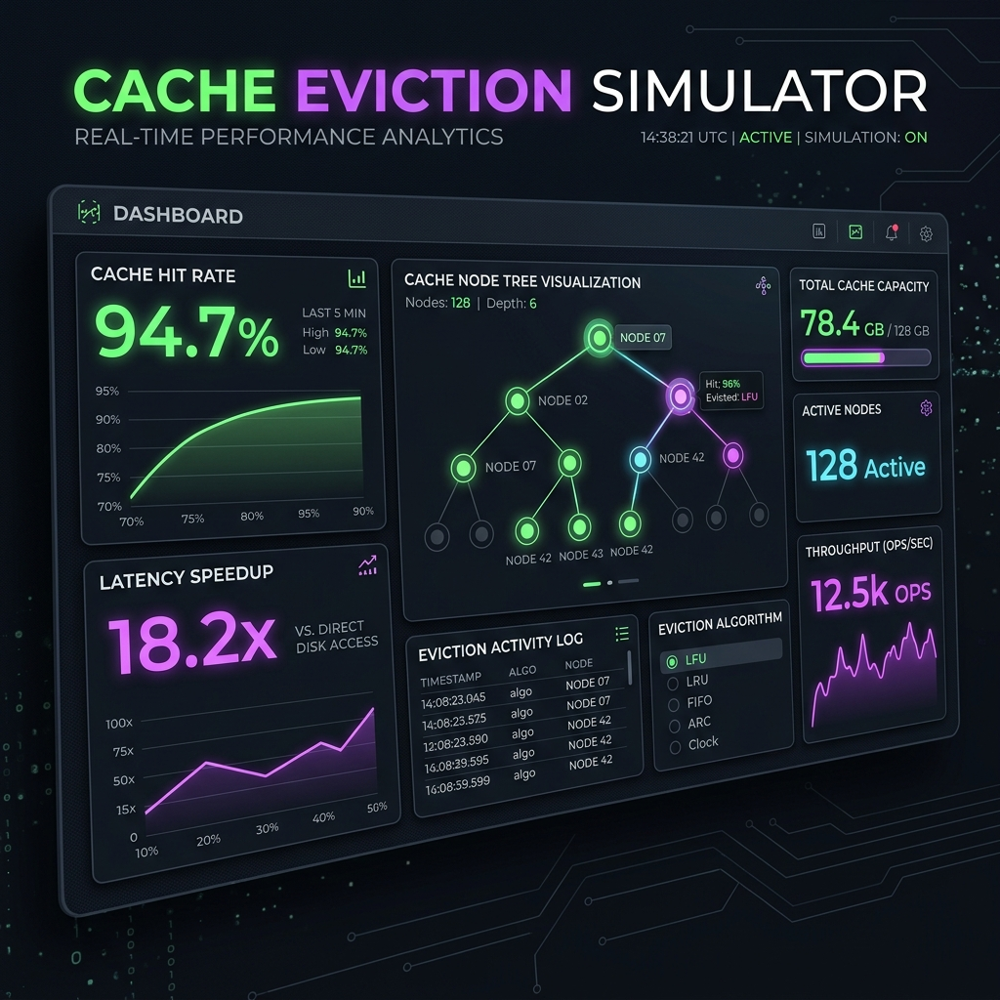
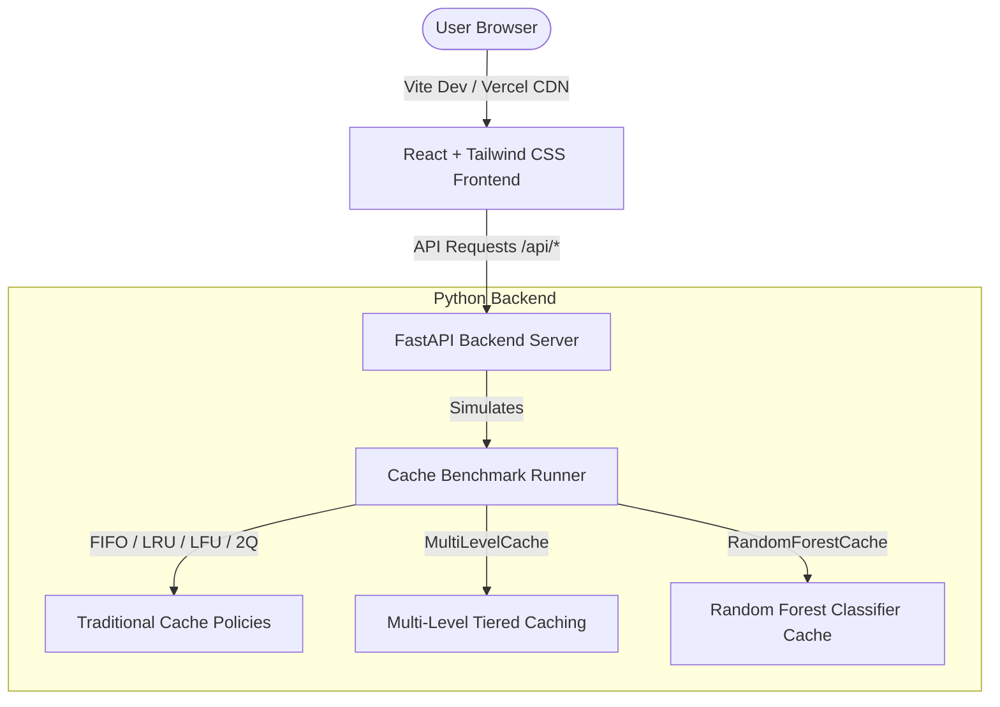

## Cache Eviction Simulator

A next-generation, interactive cache simulation platform built with **FastAPI** (Python) and **React Vite** (JavaScript). This system allows you to visual-trace and benchmark traditional cache policies, multi-level memory hierarchies, and an online-trained Machine Learning (Random Forest) cache replacement model.

 **Live Web Application (Vercel)**: [https://cache-replacement-system.vercel.app/](https://cache-replacement-system.vercel.app/)


##  Key Features

*   **Interactive Sandbox Playground**: Step through cache requests one-by-one to visualize hits, misses, and evictions key-by-key across multiple policies simultaneously.
*   **Traditional Policy Benchmark**: Side-by-side performance showdown of classic cache algorithms (FIFO, LRU, LFU, and 2Q) on various workload patterns.
*   **Tiered Memory Simulation**: Model a L1 RAM Cache + L2 Redis Cache hierarchy. Measure Effective Access Time (EAT) and database load reductions.
*   **Online Machine Learning Eviction**: Pit an online-trained Random Forest Regressor classifier against traditional heuristic policies. The model dynamically learns access frequencies, recency intervals, and features to predict future reuse distance for optimal eviction.

---

##  Architecture & Tech Stack



*   **Frontend**: React (JS), Tailwind CSS, Recharts / Chart.js, Lucide Icons, Vite
*   **Backend**: Python, FastAPI, Scikit-Learn (Random Forest Regressor), Numpy, Uvicorn
*   **Deployment**: Vercel Serverless Functions (Python runtime + Static frontend build)

---

##  Local Quick Start

### Prerequisites
*   Python 3.8 or higher
*   Node.js (v18+) and npm

### 1. Unified Launch (Recommended on Windows)
We've prepared a PowerShell script to start both the Python backend and Vite frontend dev server concurrently. Simply run:
```powershell
powershell -ExecutionPolicy Bypass -File start.ps1
```
*   **Backend URL**: `http://127.0.0.1:8000`
*   **Frontend URL**: `http://localhost:5173`

---

### 2. Manual Startup

#### Step A: Run Python FastAPI Backend
1. Install Python dependencies:
   ```bash
   pip install -r requirements.txt
   ```
2. Launch the backend:
   ```bash
   python server.py
   ```

#### Step B: Run React Frontend Dev Server
1. Navigate to the dashboard directory:
   ```bash
   cd dashboard
   ```
2. Install npm dependencies:
   ```bash
   npm install
   ```
3. Run the Vite development server:
   ```bash
   npm run dev
   ```

---

##  Vercel Deployment

This project is fully configured for Vercel using `vercel.json`.

1. Commit and push your code to your GitHub repository.
2. Link your repository in the **Vercel Dashboard**.
3. Vercel automatically detects the configuration and deploys the React SPA and the FastAPI Python serverless functions under a single domain.

---

## License
Built with ❤️ by [ninjanavya](https://github.com/ninjanavya).
